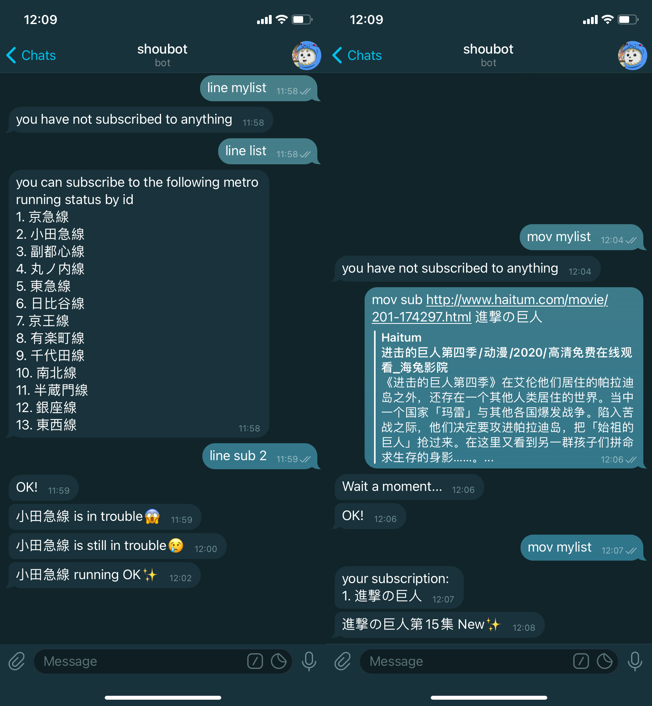
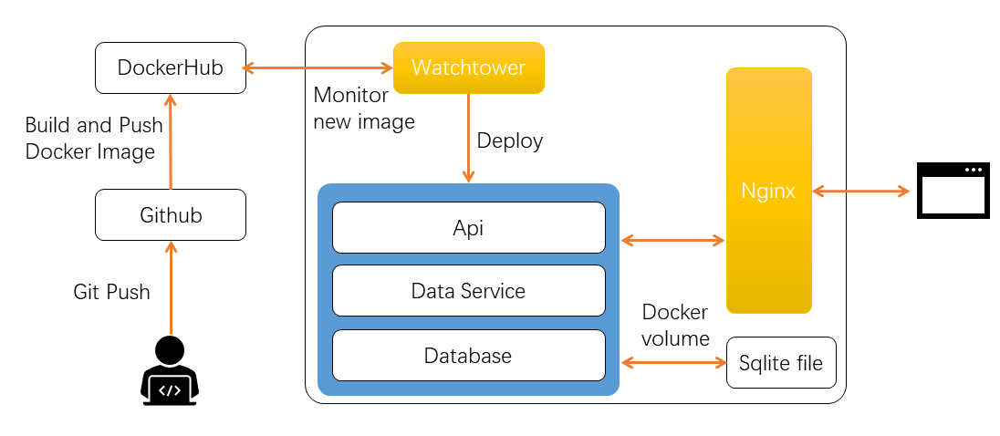
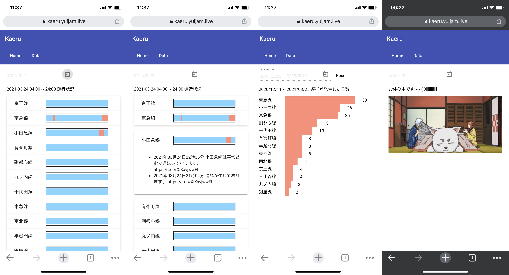
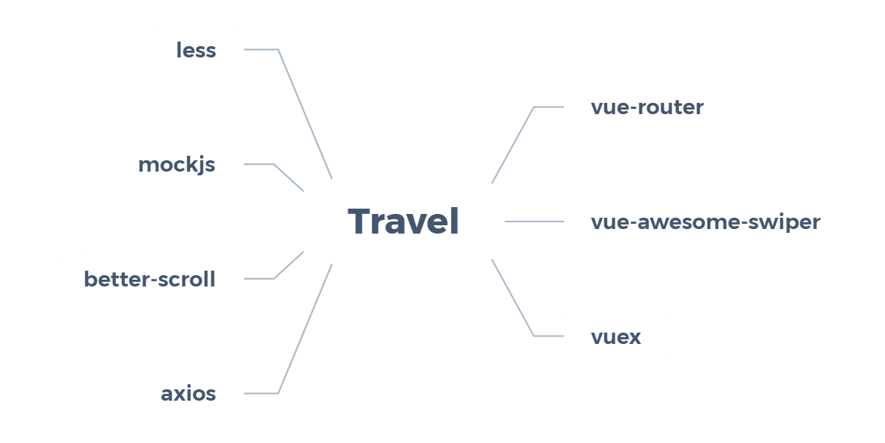

現住所：大阪府<br>
E-mail： yuijam@live.com<br>
Github：<https://github.com/Yuijam>

#### スキル
言語：TypeScript、Golang 、Lua、Haskell、Python、Linux Shell、Java、Matlab<br>
フレームワーク：React、Angular、Vue、GraphaQL、RxJs、Prism、Next.js、React-Redux、Cocos2dx-Lua<br>
データベース：MySql、MongoDB<br>
その他：Docker、AWS、Github Actions、Nginx

####          免許・資格
2015.12 | CET-6（College English Test band 6）| 合格<br>
2016.03 | 普通自動車第一種免許 | 取得<br>
2018.07 | 実用日本語検定 E レベル | 合格<br>
2019.12 | 日本語能力試験N2 | 合格<br>

#### 職歴

- 2020.2~2021.2｜ 株式会社 ワイズネット｜正社員
  - 日経seeksプロジェクトの開発
    - 自社の業務課題を外部人材で解決するマッチングサービス 
    - React、Node、TypeScript、Docker Compose、AWS、MySql、RxJs
  - ambassadorプロジェクトの開発
    - お店の会員システムと管理システム
    - React、Node、TypeScript、Docker Compose、AWS、MySql、RxJs
  - oysterプロジェクトの開発
    - FXについてのサービス
    - Angular、Node、TypeScript、Nginx
  
- 2018.2~2019.3｜深圳宇衡互联科技株式会社｜正社員
  -  社内のゲームソフトフロントエンド開発（Lua、Cocos2dx-lua）
- 2017.7~2018.1｜深圳市希瑞電子商務株式会社｜正社員
  - 社内のゲームバックエンドフレームワークの開発（Lua、Shell Script）
  - 社内のゲームフロントエンドの開発（Cocos2dx-lua）
- 2017.2~2017.4 ｜ 深圳市希瑞電子商務株式会社｜実習生
  - 第一ヶ月の勉強：Lua、Git、社内のバックエンドフレームワークの使用、社内のゲームエンジンの使用
  - 第二ヶ月の仕事：バックエンドのモジュールを開発及びテスト、フレームワークのバグを修正

#### 業務外開発

- 2021.3 ~ Shoubot<br>
  - Golangで作ったTelegramロボットです。電車の運行状況をスカウトし、ステータスが更新されたときにTelegramからの通知を受け取ることができます。アニメやドラマの更新もスカウトできます。
  - Repo：<https://github.com/Yuijam/shoubotgo>
  
  ```
    // mov command for subscribe movie update
    mov mylist  // list your own subscription list with MYLIST_ID
    mov sub URL
    mov sub URL name // admin permission
    mov unsub URL/MYLIST_ID 
    mov list       // admin permission
    mov done MYLIST_ID // admin permission
    
    // line command for subscribe metro running status
    line list   // list all currently supported metro line
    line sub LIST_ID
    line unsub LIST_ID
    line mylist  // list your own subscription list with mylistID
    line add screenName name   // admin permission
  ```

- 2020.12 ~ Kaeru
  - 東京電車の運行状況に関するデータを収集するために、このプロジェクトを作った。
  - Repo：<https://github.com/Yuijam/kaeru>
  - Url：<https://kaeru.yuijam.live/>
  - プロジェクト構成図
  
  
  

- 2019.12 ~ Travel
  - Vueを勉強するために、[qunar]( http://touch.piao.qunar.com/ )を模造した
  - Repo：<https://github.com/Yuijam/travel>
  - Url：<https://condescending-carson-c7c441.netlify.com/#/>
  
  